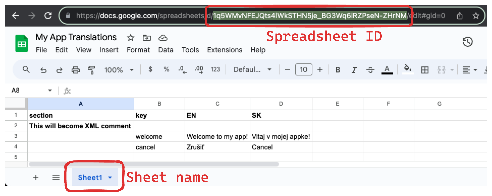

# Sheet Happens!


[](LICENSE)
[](https://plugins.gradle.org/plugin/app.futured.sheethappens)

[](https://mailchi.mp/kotlinweekly/kotlin-weekly-382)

Sheet Happens is Gradle plugin that lets you localize your Android / KMP application by generating XML string resources
from Google Spreadsheets.

## Features

- Supports strings and plurals
- Compatible with Android and Kotlin Multiplatform ([moko-resources](https://github.com/icerockdev/moko-resources))
  resources format
- Flexible configuration options
- Can be applied to multiple modules separately (useful for splitting translations per feature module)

## Installation

Make sure you have Gradle Plugin Portal in your repositories:

```kotlin
pluginManagement {
    repositories {
        gradlePluginPortal()
    }
}
```

Then add the plugin to your module-level `build.gradle` or `build.gradle.kts` file:

```kotlin
plugins {
    id("app.futured.sheethappens") version "<latestVersion>"
}
```

## Usage

### Get your Google Spreadsheet ready

Create a Google Sheet and add your translations in it:



You can use our [Sample Spreadsheet](https://docs.google.com/spreadsheets/d/1q5WMvNFEJQts4lWkSTHN5je_BG3Wq6iRZPseN-ZHrNM/edit?usp=sharing)
as a template.

Note the following:

- You can find the Spreadsheet ID in the URL and Sheet name at the bottom of the page. You will use them to configure
  connection to the Sheets API
- The __first row__ always contains names of columns. You will use these names to configure the plugin, so it knows
  where to look for specific information in your Sheet
- The Section column is optional and can be used for inserting comments in XML resource files generated by the plugin
- There always has to be a key column to identify translations and at least one column with translated strings

### Authentication

The plugin supports two authentication methods. Choose the one that fits your setup.

#### Option 1: API Key (public spreadsheets)

Use an API key when your spreadsheet is publicly readable (shared with "Anyone with the link").

1. Go to [Google Cloud console](https://console.cloud.google.com/) and select your project, or create a new one
2. In `APIs & Services`, enable the `Google Sheets API`
3. In `APIs & Services > Credentials`, generate a new API key. Restrict it to the Google Sheets API as a best practice.
4. Make your Google Sheet accessible to anyone with the link (read-only).

#### Option 2: Service Account (private spreadsheets)

Use a service account when your spreadsheet is private.

1. Go to [Google Cloud console](https://console.cloud.google.com/) and select your project, or create a new one
2. In `APIs & Services`, enable the `Google Sheets API`
3. In `IAM & Admin > Service Accounts`, create a new service account
4. Open the service account, go to the `Keys` tab, click `Add Key > Create new key`, select `JSON`, and download the key file
5. In your Google Sheet, click `Share` and grant the service account's email address (e.g. `my-service-account@my-project.iam.gserviceaccount.com`) **Viewer** access
6. Store the key file securely — **do not commit it to version control**

### Plugin Configuration

Use the `sheetHappens` configuration block to configure the plugin. Set either `apiKey` or `serviceAccountKeyFile`
depending on your chosen [authentication method](#authentication) — these two options are mutually exclusive.

```kotlin
sheetHappens {
    spreadsheetId.set("Spreadsheet ID, eg. bKGtVRjP-m_HNsiZJNE5qWH3FweSNlRQv4tsM1WkF65J7ZgqB_WWqN")
    sheetName.set("Sheet name, eg. Sheet1")

    // Option 1: API key (spreadsheet must be publicly accessible)
    apiKey.set("API Key ****")

    // Option 2: Service account key file (works with private spreadsheets)
    serviceAccountKeyFile.set(layout.projectDirectory.file("service-account-key.json"))

    sheetLayout {
        sectionColumnName.set("section") // Optional
        keyColumnName.set("key")

        // Add language column for each translation
        languageColumn("EN" to "values")
        languageColumn("SK" to "values-sk")
        // You can reuse existing translation for users with different system language
        languageColumn("SK" to "values-cs")
    }

    resourcesLayout {
        resourcesDir.set(layout.projectDirectory.dir("src/main/res"))

        splitResources = false // Optional, default `false`
        stringsFileName = "strings.xml" // Optional, default "strings.xml" 
        pluralsFileName = "plurals.xml" // Optional, default "plurals.xml"
    }
}
```

The `sheetLayout` object tells the plugin where to look for section names, string keys and each of translations.

The `languageColumn()` function takes a pair of Strings, where former is the translation column name in Google Sheet and
latter is resource folder where strings for this translation will be generated.

The `resourcesLayout` object tells the plugin how to structure generated strings in your project.  
Strings are generated in the `strings.xml` file by default. You can specify name of this file using `stringsFileName`
Property.

If you wish to generate plurals in separate file, you can set `splitResources = true` and plurals will be placed in the
second file named by `pluralsFileName` property.
This is required if you want to use plugin with KMP ([moko-resources](https://github.com/icerockdev/moko-resources))
library.

### Usage

The plugin will register a Gradle task called `makeSheetHappen` 🦄 which will read your Google Sheet and generate string
resources for each language column you specified.

```shell
./gradlew makeSheetHappen
```

### Security

**API key:** Avoid hardcoding the API key in your build file. Store it in `local.properties` (gitignored by default in
Android projects) and read it at configuration time:

```kotlin
import java.util.Properties

val localProperties = Properties().apply {
    val file = rootProject.file("local.properties")
    if (file.exists()) load(file.inputStream())
}

sheetHappens {
    // ...
    apiKey.set(localProperties.getProperty("sheetHappens.apiKey"))
}
```

```properties
# local.properties
sheetHappens.apiKey=YOUR_API_KEY
```

**Service account key file:** Never commit the JSON key file to version control. Add it to `.gitignore` and supply it
via a local path or inject it through CI/CD secrets.

## Sheet formatting

All translations can contain string placeholders, such as `%s` or `%1$s`.

To insert a plural, you name a string using `key##{pluralQualifier}` format, such
as `plural_days##{one}`, `plural_days##{few}`and so on.
All plural strings of the same key must be grouped together in the sheet.

## Sample

The sample project is set up in `:sample` module. You can create your own Google Sheet using instructions above and
play around.

## Contributors

Current maintainer and main contributor is [@matejsemancik](https://github.com/matejsemancik).

For release process, see [RELEASE.md](RELEASE.md)

## Licence

This project is available under MIT license. See [LICENSE file](LICENSE) for more information.

## Credits

This Gradle plugin was inspired by
Ackee's [Spreadsheet Localizer INTELLIJ IDEA plugin](https://github.com/AckeeCZ/Spreadsheet-Localizer-Plugin) & it is
fully compatible with their Google Sheet formatting.

This Gradle plugin improves on this concept by giving you more configuration options and ability to run it from command
line or CI environment as Gradle task.

Various bits and pieces of inspiration were taken from https://github.com/cortinico/kotlin-gradle-plugin-template
and https://github.com/iurysza/module-graph
