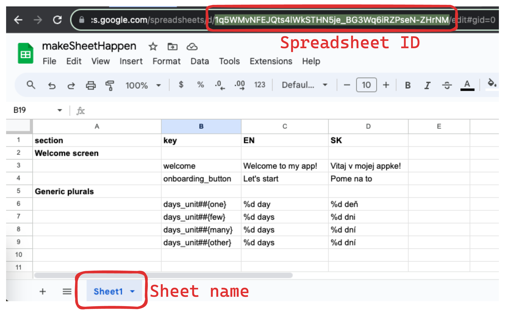

# Sheet Happens! 🦄

Sheet Happens is Gradle plugin that lets you localize your Android / KMP application by generating XML string resources
from Google Spreadsheets.

## Features

- Supports strings and plurals
- Compatible with Android and Kotlin Multiplatform ([moko-resources](https://github.com/icerockdev/moko-resources))
  resources format
- Flexible configuration options
- Can be applied to multiple modules separately (useful for splitting translations per feature module)

## Installation

Make sure you have Gradle Plugin Portal in your repositories:

```kotlin
pluginManagement {
    repositories {
        gradlePluginPortal()
    }
}
```

Then add the plugin to your module-level `build.gradle` or `build.gradle.kts` file:

```kotlin
plugins {
    id("app.futured.sheethappens") version "$latestVersion"
}
```

## Usage

### Get your Google Spreadsheet ready

1. Get yourself an API key to [Google Sheets API](https://developers.google.com/sheets/api/guides/concepts). Please
   refer [here](GOOGLE_API_KEY.md) for more detailed instructions.
2. Create a Google Sheet and add your translations in it:



Note the following:

- You can find the Spreadsheet ID in the URL and Sheet name at the bottom of the page. You will use them to configure
  connection to the Sheets API
- The __first row__ always contains names of columns. You will use these names to configure the plugin, so it knows
  where
  to look for specific information in your Sheet
- The Section column is optional and can be used for inserting comments in XML resource files generated by the plugin
- There always has to be a key column to identify translations and at least one column with translated strings

### Plugin Configuration

Use the `sheetHappens` configuration block to configure the plugin, these are all available options:

```kotlin
sheetHappens {
    spreadsheetId.set("Spreadsheet ID, eg. bKGtVRjP-m_HNsiZJNE5qWH3FweSNlRQv4tsM1WkF65J7ZgqB_WWqN")
    sheetName.set("Sheet name, eg. Sheet1")
    apiKey.set("API Key ****")

    sheetLayout {
        sectionColumnName.set("section") // Optional
        keyColumnName.set("key")

        // Add language column for each translation
        languageColumn("EN" to "values")
        languageColumn("SK" to "values-sk")
        // You can reuse existing translation for users with different system language
        languageColumn("SK" to "values-cs")
    }

    resourcesLayout {
        resourcesDir.set(layout.projectDirectory.dir("src/main/res"))

        splitResources = false // Optional, default `false`
        stringsFileName = "strings.xml" // Optional, default "strings.xml" 
        pluralsFileName = "plurals.xml" // Optional, default "plurals.xml"
    }
}
```

The `sheetLayout` object tells the plugin where to look for section names, string keys and each of translations.

The `languageColumn()` function takes a pair of Strings, where former is the translation column name in Google Sheet and
latter is resource folder where strings for this translation will be generated.

The `resourcesLayout` object tells the plugin how to structure generated strings in your project.  
Strings are generated in the `strings.xml` file by default. You can specify name of this file using `stringsFileName`
Property.

If you wish to generate plurals in separate file, you can set `splitResources = true` and plurals will be placed in the
second file named by `pluralsFileName` property.
This is required if you want to use plugin with KMP ([moko-resources](https://github.com/icerockdev/moko-resources))
library.

### Usage

The plugin will register a Gradle task called `makeSheetHappen` 🌈 which will read your Google Sheet and generate string
resources for each language column you specified.

```shell
./gradlew makeSheetHappen
```

## Sheet formatting

All translations can contain string placeholders, such as `%s` or `%1$s`.

To insert a plural, you name a string using `key##{pluralQualifier}` format, such
as `plural_days##{one}`, `plural_days##{few}`and so on.
All plural strings of the same key must be grouped together in the sheet.

## Sample

The sample project is set up in `:sample` module. You can create your own Google Sheet using instructions above and
play around.

Also, [here](https://docs.google.com/spreadsheets/d/1q5WMvNFEJQts4lWkSTHN5je_BG3Wq6iRZPseN-ZHrNM/edit?usp=sharing) you
can take a look at sample Google Spreadsheet.

## Credits

This Gradle plugin was inspired by
Ackee's [Spreadsheet Localizer INTELLIJ IDEA plugin](https://github.com/AckeeCZ/Spreadsheet-Localizer-Plugin) & it is
fully compatible with their Google Sheet formatting.

This plugin improves on this concept by giving you more configuration options and ability to run it from command line or
CI environment as Gradle task.